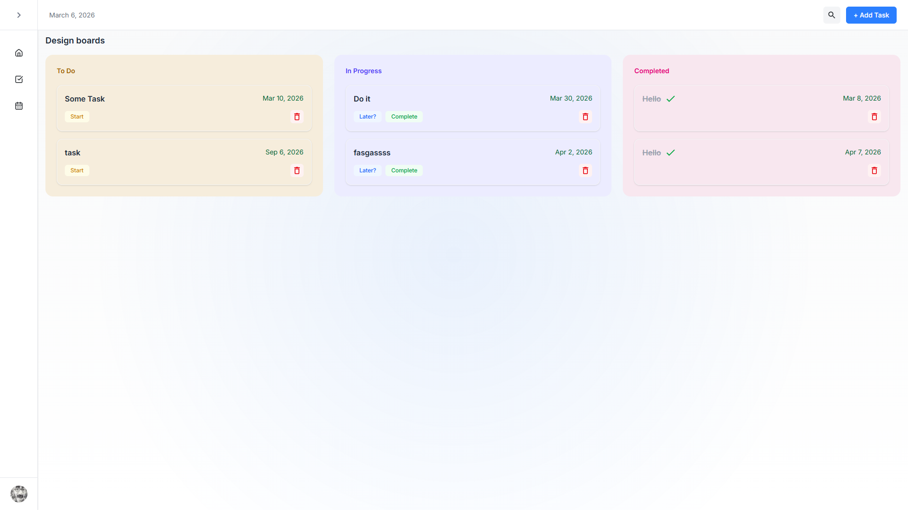
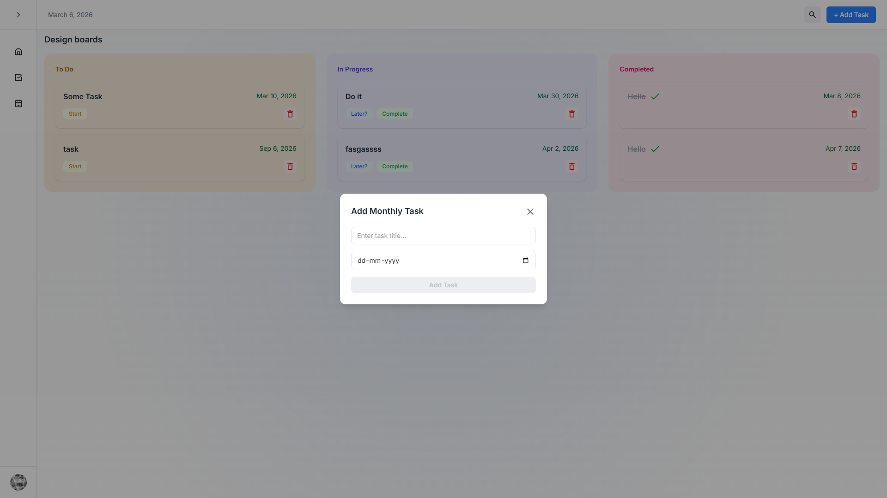
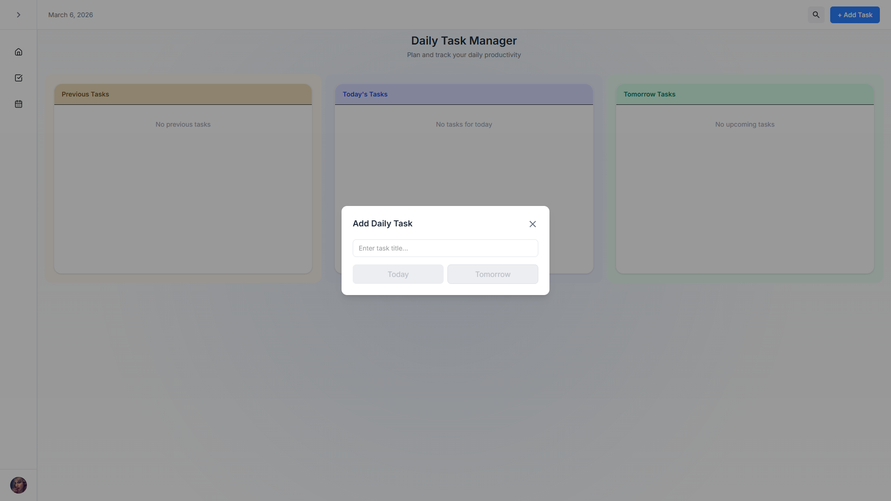
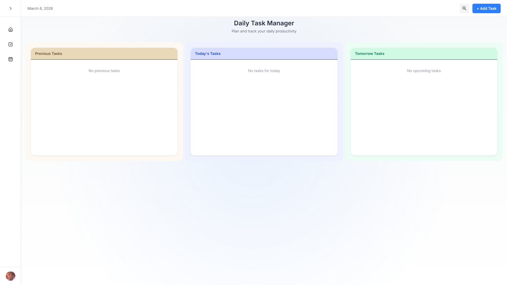
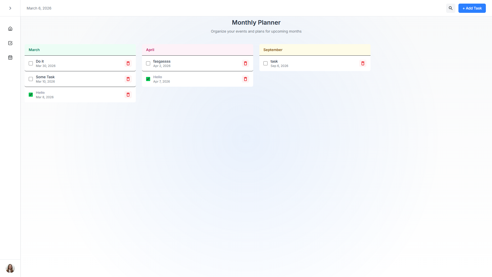

# 📝 TodoList — Next.js Task Management App

A modern **Todo List application** built using **Next.js 14**, **React 18**, **TailwindCSS**, and **Material UI**.
The goal of this project is to provide a clean task management experience while also serving as a **learning-friendly open source project** for developers who want to contribute and improve their full-stack skills.

This repository is intentionally structured to encourage **real-world collaboration workflows**, similar to how production teams operate.

---

# 🚀 Tech Stack

| Category      | Technologies             |
| ------------- | ------------------------ |
| Framework     | Next.js 14               |
| UI Library    | React 18                 |
| Styling       | TailwindCSS              |
| UI Components | Material UI              |
| Icons         | Lucide React + MUI Icons |
| Animation     | Anime.js                 |
| Tooling       | PostCSS, Autoprefixer    |

---

## 📸 UI Preview

### Home Page


### Add Monthly Task


### Add Daily Task


### Daily Task Page


### Monthly Task Page


# 📦 Installation & Local Setup

Follow these steps to run the project locally.

### 1️⃣ Clone the repository

```bash
git clone https://github.com/<your-username>/todolist.git
```

### 2️⃣ Navigate to the project directory

```bash
cd todolist
```

### 3️⃣ Install dependencies

```bash
npm install
```

### 4️⃣ Run the development server

```bash
npm run dev
```

Now open:

```
http://localhost:3000
```

---

# 📁 Project Scripts

| Command         | Purpose                  |
| --------------- | ------------------------ |
| `npm run dev`   | Runs development server  |
| `npm run build` | Builds production bundle |
| `npm start`     | Runs production build    |
| `npm run lint`  | Runs ESLint checks       |

---

# 🤝 Contributing Guidelines

This project welcomes contributions from developers of **all experience levels**.
However, contributions must follow **clear standards to maintain project quality**.

Please read these rules carefully before submitting a pull request.

---

# 📌 Contribution Rules

## 1️⃣ UI Changes

If your contribution modifies the **user interface**, you must:

• Include **before and after screenshots** in the Pull Request
• Explain **what UI component was modified**
• Describe **why the change improves the UI**

Example:

```
Feature: Improved Task Card Layout

Changes:
- Added hover animation
- Improved checkbox styling
- Updated spacing for readability

Impact:
Better visual hierarchy and improved interaction feedback
```

---

## 2️⃣ Backend or Logic Changes

If your contribution modifies **logic, state management, or APIs**, you must:

• Clearly explain **what was changed**
• Provide **usage examples**
• Describe the **impact on application behavior**

Example:

```
Feature: Optimized Task Completion Logic

Changes:
- Updated reducer logic for task state updates
- Reduced unnecessary re-renders

Example Usage:
dispatch({
  type: "TASK_COMPLETED",
  payload: { month: 2, index: 4 }
})

Impact:
Improves state update performance and prevents UI flickering
```

---

## 3️⃣ Code Quality Standards

All contributions must follow these rules:

✔ Use **clean and readable code**
✔ Follow **existing project structure**
✔ Avoid unnecessary dependencies
✔ Write meaningful commit messages
✔ Test your changes before submitting a PR

Pull requests that do not follow these guidelines may be rejected.

---

# 🔄 Contribution Workflow

Follow this workflow when contributing.

---

## Step 1 — Fork the Repository

Click the **Fork** button at the top right of the repository page.

This creates your own copy of the project.

---

## Step 2 — Clone Your Fork

```bash
git clone https://github.com/<your-username>/todolist.git
```

---

## Step 3 — Create a New Branch

Never work directly on `main`.

```bash
git checkout -b feature/your-feature-name
```

Example:

```
feature/improve-checkbox-ui
```

---

## Step 4 — Make Your Changes

Update the code, test your changes locally, and ensure everything works.

---

## Step 5 — Commit Your Changes

```bash
git add .
git commit -m "feat: improved checkbox UI with animations"
```

---

## Step 6 — Push to Your Fork

```bash
git push origin feature/your-feature-name
```

---

## Step 7 — Create a Pull Request

Go to your fork on GitHub and click:

```
New Pull Request
```

Provide:

• A **clear description** of your changes
• **Screenshots (if UI updates)**
• **Examples (if backend updates)**

---

# 🧠 Good First Contributions

If you are new to open source, you can start with:

• UI improvements
• Accessibility improvements
• Performance optimizations
• Code refactoring
• New task management features

---

# 🌍 Open Source Mission

This project is **open for contributions** from developers who want to learn, build, and collaborate.

Whether you are a beginner exploring open source or an experienced developer improving the architecture, your contributions are welcome.

---

# ⭐ Support the Project

If you found this project helpful:

**Don't just fork — star too ⭐**

It helps the project grow and reach more developers.

---

# 🚀 Final Note

This project is **completely free for newcomers** to explore the codebase, understand how things work, and build something crazy together.

Let’s learn, collaborate, and ship great software.

Happy coding 👨‍💻
